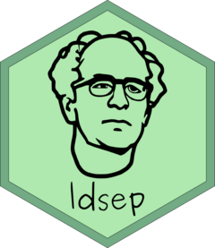

<!-- README.md is generated from README.Rmd. Please edit that file -->

# ldsep: Linkage Disequilibrium Shrinkage Estimation for Polyploids <a href='https://dcgerard.github.io/ldsep/'></a>

<!-- badges: start -->

[](https://www.tidyverse.org/lifecycle/#stable)
[](https://github.com/dcgerard/ldsep/actions)
[](https://codecov.io/gh/dcgerard/ldsep)
[](https://CRAN.R-project.org/package=ldsep)
[](https://cran.r-project.org/package=ldsep)
[](https://www.gnu.org/licenses/gpl-3.0)
<!-- badges: end -->

Estimate haplotypic or composite pairwise linkage disequilibrium (LD) in
polyploids, using either genotypes or genotype likelihoods. Support is
provided to estimate the popular measures of LD: the LD coefficient
\(D\), the standardized LD coefficient \(D'\), and the Pearson
correlation coefficient \(r\). All estimates are returned with
corresponding standard errors. These estimates and standard errors can
then be used for shrinkage estimation. The methods are described in
Gerard (2020).

The main functions are:

  - `ldest()`: Estimates pairwise LD.
  - `mldest()`: Iteratively apply `ldest()` across many pairs of SNPs.
  - `sldest()`: Iteratively apply `ldest()` along a sliding window of
    fixed length.
  - `plot.lddf()`: Plot method for the output of `mldest()` and
    `sldest()`.
  - `format_lddf()`: Format the output of `mldest()` and `sldest()` into
    a matrix.
  - `ldshrink()`: Shrink correlation estimates using adaptive shrinkage
    (Stephens, 2017; Dey and Stephens, 2018).

## Installation

You can install the released version of ldsep from
[CRAN](https://CRAN.R-project.org) with:

``` r
install.packages("ldsep")
```

And the development version from [GitHub](https://github.com/) with:

``` r
# install.packages("devtools")
devtools::install_github("dcgerard/ldsep")
```

## Code of Conduct

Please note that the ldsep project is released with a [Contributor Code
of
Conduct](https://contributor-covenant.org/version/2/0/CODE_OF_CONDUCT.html).
By contributing to this project, you agree to abide by its terms.

## References

  - Dey, Kushal K., and Matthew Stephens. “CorShrink: Empirical Bayes
    shrinkage estimation of correlations, with applications.” *bioRxiv*
    (2018): 368316.
  - Gerard, David. “Pairwise Linkage Disequilibrium Estimation for
    Polyploids.” *bioRxiv* (2020):
    [doi:10.1101/2020.08.03.234476](https://doi.org/10.1101/2020.08.03.234476).
  - Stephens, Matthew. “False discovery rates: a new deal.”
    *Biostatistics* 18, no. 2 (2017): 275-294.
